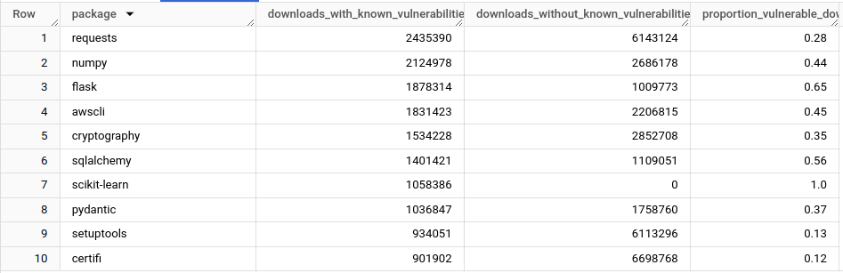

Investigating downloads of vulnerable Python packages from PyPI.

# Supporters

<a href="https://equalexperts.com">
    
    </img>
</a>

# Generated Resources

- DBT Documentation on [GitHub Pages](https://brabster.github.io/pypi_vulnerabilities).
- Public Dataset on BigQuery US Location: `pypi-vulnerabilities.pypi_vulnerabilities_us`

# Stability and Versioning

- Please consider the BigQuery dataset structure and schema to be experimental and subject to unannounced breaking changes at this stage. If you wish for me to hold something stable, please raise an issue to let me know.
- I do not version this dataset as I will not be maintaining previous versions.

# Timeframe

I'm performing this initial analysis on package downloads performed on a specific date, 2023-11-05. There's a few reasons for that:

- PyPI downloads is a big dataset - days in late 2023 are on the order of 250GB. At $5/TB scanned, that's about a dollar a day to scan one day of the full dataset.
- The Safety public dataset is updated monthly, so I can use a the 2023-10-01 update to be sure that any vulnerabilities I'm considering have been in the public domain and accessible via tools for at least a month.

I can get an idea of what's going on and figure out how to solve the problems that need solving with a relatively small snapshot dataset, so I copy just the columns I need for one day with minimal processing to a new table and work from that.

# Example Query

## Top Ten Packages by Number of Vulnerable Downloads

Bills 94MB

```sql
SELECT
  package,
  was_vulnerable,
  downloads,
  proportion_vulnerable_downloads
FROM `pypi-vulnerabilities.pypi_vulnerabilities_us.vulnerable_downloads_by_package`
WHERE was_vulnerable
ORDER BY downloads DESC
LIMIT 10
```



# Contributing

See [CONTRIBUTORS.md](CONTRIBUTORS.md) for guidance.

## Pre-Reqs

- Python == 3.11 (see https://docs.getdbt.com/faqs/Core/install-python-compatibility)
- [RECOMMENDED] VSCode to use built-in tasks
- Access to GCP Project enabled for BigQuery
- [RECOMMENDED] set environment variable `PIP_REQUIRE_VIRTUALENV=true`
    - Prevents accidentally installing to your system Python installation (if you have permissions to do so)

## Setup Local

Setting up the local software without any need for Data Warehouse credentials.

A VSCode task triggers a shell script [.dev_scripts/init_and_update.sh](.dev_scripts/init_and_update.sh)
which should take care of setting up a virtualenv if necessary, then installing/updating software and running a vulnerability scan.

> Note - the vulnerability scan is performed using [safety](https://pypi.org/project/safety/), which is *not free for commercial use* and has limitations on freshness and completeness of the vulnerability database.

That script describes the steps involved in a full setup if you are unable to run a bash script and need to translate to some other language.

## Connect to Data Warehouse

Set up credentials and environment and test connectivity.

- update .env with appropriate values
    - note project ID not project name (manifests as 404 error)
    - `. .env` to update values in use in terminal
- get credentials
    - if no valid credential, then error message says default credentials not found
    - must be application default credential
    - `gcloud auth application-default login`
- `dbt debug` should now succeed and list settings/versions
    - if `dbt` is not found, you may need to activate your venv at the terminal as described earlier

# Obtaining Safety DB in BigQuery

I use the public database used by the [safety] package as a reference for which PyPI packages have known vulnerabilities.

Automation is provided to take care of making the current version of the [public Safety DB](https://github.com/pyupio/safety-db/tree/master/data) available as a BigQuery table. The source data is stored as a large JSON array, so needs a bit of processing before it can be loaded into BigQuery.

1. [etl/safety_db_to_jsonl.py](etl/safety_db_to_jsonl.py) downloads the July 1, 2022 update from GitHub and converts to a jsonlines format.
    - this script outputs to the `uncommitted` dir in the repo, which is `.gitignore`d. 
1. [etl/safety_jsonl_to_bq.py](etl/safety_jsonl_to_bq.py) loads the file produced by the previous script into a BigQuery table.
    - this script defaults to environment variables values matching those in your `.env` file. That seems like a sensible default but can be overridden with command line arguments.
