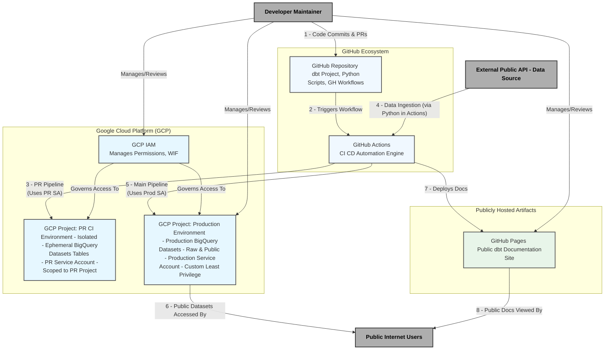

# Threat Model: pypi-vulnerabilities

- **Author/Reviewer(s):** Threat Modeling Coaching Session (User & AI Assistant)

## 1. Introduction

### 1.1 Purpose
This document outlines the threat model for a data processing application that utilizes dbt for transformations within Google BigQuery, with CI/CD orchestrated by GitHub Actions. The system produces publicly accessible BigQuery datasets (sourced from public data) and a publicly deployed dbt documentation website on GitHub Pages. The purpose of this threat model is to identify potential security and operational risks, and to document agreed-upon mitigations and controls.

### 1.2 System Overview
The application involves:
* **Data Ingestion:** A Python script fetches data from an external public API.
* **CI/CD:** GitHub Actions automates the build, test, and deployment processes for both the dbt transformations and the public documentation. Separate CI/CD pipelines and GCP environments are used for Pull Requests (PRs) and the `main` (production) branch.
* **Data Transformation:** dbt Core is used to transform raw data into structured, public-facing datasets within Google BigQuery.
* **Data Storage:** Google BigQuery houses both raw ingested data and the final transformed public datasets.
* **Documentation:** dbt docs are generated and deployed to GitHub Pages for public consumption.
* **Development Context:** The system is currently maintained by a sole developer who also manages all merges to the main production branch.

### 1.3 Scope
This threat model covers the GitHub repository containing the dbt project, Python scripts, and GitHub Actions workflows; the GitHub Actions CI/CD execution environments; the Google Cloud Platform (GCP) projects used for PR/CI and Production BigQuery environments; the dbt transformation process; the Python data ingestion script; and the publicly exposed data and documentation.

### 1.4 Assumptions
The following key assumptions, based on our discussions, underpin this threat model:
* The data ingested from the external public API and subsequently published in the BigQuery datasets is *intended* to be public.
* The dbt documentation website is *intended* to be publicly accessible.
* The primary developer is currently the sole maintainer and the only individual with permissions to merge code to the `main` branch and manage production GCP resources.
* The development and CI/CD processes will adhere to the agreed-upon security controls and mitigations outlined in this document.
* Standard security practices are followed for the developer's GitHub account (e.g., strong unique password, 2FA).

## 2. System Architecture Overview

The following diagram provides a high-level overview of the system components and their interactions:

### 3. Identified Threats and Mitigations

The following table details the identified threats, their potential impact, qualitative likelihood and risk levels based on our discussions, and the agreed-upon mitigations or controls.

| Threat ID | Threat Description                                                                                                                               | Potential Impact                                                                        | Assessed Likelihood | Assessed Risk | Agreed Mitigations & Controls                                                                                                                                                                                                                                                                                                                                                                                                                                                                                      | Status of Mitigation         |
| :-------- | :----------------------------------------------------------------------------------------------------------------------------------------------- | :-------------------------------------------------------------------------------------- | :------------------ | :------------ | :----------------------------------------------------------------------------------------------------------------------------------------------------------------------------------------------------------------------------------------------------------------------------------------------------------------------------------------------------------------------------------------------------------------------------------------------------------------------------------------------------------------- | :--------------------------- |
| T-001     | **Malicious Commit/Code Tampering:** Unauthorized or malicious changes to dbt models, Python scripts, GitHub Actions workflow files, or local actions committed to the `main` branch. | Data corruption/loss, data exfiltration, denial of service, unauthorized GCP resource usage. | Medium              | High          | - Mandatory Pull Requests (PRs) for all changes to `main`. - Developer (sole merger) uses 2FA and short-lived credentials for GitHub account. - **(Agreed to Add)** Mandatory PR status checks: SQL/dbt linting (SQLFluff), Python linting (Flake8) & SAST (Bandit), GitHub Actions workflow linting (Actionlint). - Rigorous self-review of PRs.                                                                                                                                                  | Partially In Place, Enhancements Agreed |
| T-002     | **Supply Chain Attacks (Dependencies & Actions):** Malicious code introduced via compromised Python dependencies, dbt packages, or third-party GitHub Actions. | Same as T-001. Could also lead to credential theft from CI environment.                     | Medium              | High          | - **Python Dependencies:** Mandatory PR vulnerability scanning (currently `safety`, moving to Snyk). - **GitHub Actions:** Strict allowlist of `github/*` and `google/*` namespaces; version tags (e.g., `@v4`) accepted for these trusted publishers (reasoned risk acceptance for operational ease). - **dbt Packages:**   - `dbt-labs/dbt_utils`: Version range used; `package-lock.yml` not committed (reasoned risk acceptance for latest trusted patches & lower overhead). CI build's lockfile can be archived for audit.   - `brabster/dbt_materialized_udf`: Maintained by developer (first-party); pinned to specific commit SHA in `packages.yml`. | Partially In Place, Enhancements Agreed |
| T-003     | **PR Pipeline Execution Against Production BigQuery Environment:** PR automated checks running with credentials that can modify production BigQuery data before merge. | Data loss/corruption in production from unmerged PR code, bypass of merge controls.      | High (if not mitigated) | Critical      | **(Agreed Mitigation):** Implement a **separate, isolated GCP project** for PR-triggered CI/CD pipeline runs. This PR environment will have its own dedicated, least-privilege Service Account, and PR workflows will target this environment, isolating them completely from production.                                                                                                                                                                                                         | Agreed to Implement        |
| T-004     | **Excessive Service Account Privileges (Production Pipeline):** The CI/CD Service Account for the `main` branch (production) pipeline having overly broad permissions (e.g., `BigQuery Admin`). | Amplifies impact of other compromises (e.g., T-001, T-002), allowing widespread data modification/deletion or resource misuse. | Medium              | High          | **(Agreed Mitigation):** Create a **custom GCP IAM role** for the production CI/CD Service Account with granular, least-privilege permissions (dataset get/create/update; table get/list/create/updateData/update/delete; routine get/list/create/update/delete; jobs create). This role will *exclude* `bigquery.datasets.delete`. The `BigQuery Admin` role will be removed from this Service Account. | Agreed to Implement        |
| T-005     | **Risky Automated Cleanup Operation (Tables/Views):** Automated dbt macro deleting "orphaned" tables/views within datasets (`dry_run: False`) could cause data loss if logic is flawed or dbt graph is manipulated. | Accidental or malicious deletion of production tables/views.                                | Medium              | High          | **(Agreed Mitigation):** Modify pipeline: Cleanup macro defaults to `dry_run: True`, outputting objects for review. A separate manual action/trigger by the developer is required for actual deletion.                                                                                                                                                                                                                                                                                                    | Agreed to Implement        |
| T-006     | **Unsafe Deletion of Redundant Datasets:** No secure process after removing `bigquery.datasets.delete` from the main CI/CD Service Account. | Accidental deletion of entire datasets by a manual process, or datasets not being cleaned up leading to clutter/cost. | Low-Medium          | Medium        | **(Agreed Mitigation):** The dbt pipeline will *identify* potentially redundant datasets and report them. The developer will manually review and then perform any actual dataset deletions using their own appropriately privileged user credentials, separate from the CI/CD SA. | Agreed to Implement        |
| T-007     | **External Public API Risks (Data Ingestion):** Dependency on an external public API for data ingestion.                                           | Data unavailability, data integrity issues (corruption, unexpected schema changes, poor quality), pipeline failures. | Medium              | Medium        | - Python script uses `urllib.request` (default HTTPS/SSL validation). - Transient API unavailability handled by "next scheduled run" (pipeline is idempotent, not time-critical - accepted risk/approach). - Persistent API unavailability results in script failure, triggering an email notification. - Data integrity/quality/structural changes primarily caught by downstream SQL-based tests ("write-audit-publish" pattern); failures halt updates to public data and prompt investigation. | In Place (Current Controls)  |
| T-008     | **Public Documentation Information Disclosure:** Inadvertent exposure of sensitive internal details, TODOs, or non-public model information via the publicly deployed dbt documentation website. | Reputational damage, exposure of internal workings or unready features, attacker reconnaissance. | Low-Medium          | Medium        | - Developer already writes metadata with a public audience in mind. - **(Agreed Mitigation):** The `dbt docs generate` command in the workflow will use model selection (e.g., `--select tag:public`) to ensure only intentionally public-facing models and their metadata are included in the deployed GitHub Pages site. | Partially In Place, Enhancement Agreed |

### 4. Other Operational Considerations & Accepted Risks

Beyond the specific threats and mitigations detailed above, several operational aspects and areas of reasoned risk acceptance were discussed:

* **Public Dataset Operational Costs/Efficiency:**
    * **Consideration:** While detailed table optimizations for the publicly exposed BigQuery datasets (such as partitioning by a relevant date column or clustering by frequently filtered columns) were deferred for now to prioritize other security mitigations, these remain important best practices.
    * **Impact if Not Optimized:** Suboptimal table structures can lead to higher storage costs for the project owner and slower, more expensive queries for public users.
    * **Recommendation/Accepted Risk:** It is recommended to periodically review the feasibility of implementing these BigQuery table optimizations as the datasets grow or usage patterns become clearer. For now, the current structure is accepted, with the understanding that optimizations can be future enhancements.

* **Monitoring & Alerting for Data Quality from External API (Relates to T-007):**
    * **Context:** Your current "write-audit-publish" pattern, with downstream SQL tests, serves as the primary gate for data quality issues originating from the external public API. Pipeline failures (which trigger email notifications) alert you to persistent API unavailability or issues caught by these downstream tests.
    * **Consideration:** While robust, this is a reactive approach to data quality issues from the API.
    * **Recommendation/Accepted Risk:** The current setup is accepted. However, if the external API's stability or data quality becomes a recurring concern, enhancing the Python ingestion script with more proactive monitoring (e.g., for significant data deviations like unexpected record counts, schema drift not caught by minimal checks, or a sudden increase in nulls for important fields) or more granular alerting directly from the ingestion step could be considered as a future improvement.

* **`dbt_utils` Versioning & `package-lock.yml` (Relates to T-002):**
    * **Context:** You use a version range (`>=1.1.1`) for the `dbt-labs/dbt_utils` package in `packages.yml` and intentionally do not commit the `package-lock.yml` file to source control.
    * **Reasoning:** This approach prioritizes automatically receiving the latest patches and minor updates from this highly trusted source (`dbt-labs`) and lowers your operational overhead for managing frequent small updates.
    * **Accepted Risk:** This is a reasoned risk acceptance. It acknowledges a trade-off against guaranteed build-to-build reproducibility of all transitive dependencies (which a committed lockfile would provide). The risk of a problematic minor/patch update from `dbt-labs/dbt_utils` causing an issue is considered low.
    * **Compensating Control:** Archiving the `package-lock.yml` generated by CI builds provides a record for auditing specific past builds if necessary.

* **GitHub Action Pinning (Relates to T-002):**
    * **Context:** Your CI/CD workflows use version tags (e.g., `@v4`) for GitHub Actions.
    * **Control:** Usage is strictly limited to your allowlist of highly trusted publishers (`github/*`, `google/*`).
    * **Reasoning & Accepted Risk:** This is a reasoned risk acceptance. It balances security (by trusting only reputable, official sources) with operational ease, avoiding the maintenance overhead of SHA pinning and managing Dependabot updates for these specific, highly reliable actions. The risk of a tag being maliciously retargeted by these specific providers is deemed very low.

* **Developer Availability (Implicit Operational Risk):**
    * **Context:** As the sole developer and maintainer, your availability is critical for responding to incidents, reviewing PRs, managing manual approval steps (like for deletions), and implementing further security enhancements.
    * **Consideration:** This is an inherent operational aspect of a solo-managed project.
    * **Recommendation:** Ensure all credentials, access methods, and documentation (like this threat model) are securely managed and potentially shareable/transferable should the need arise in the future.

### 5. Conclusion

This threat modeling exercise has systematically reviewed the data processing application, identifying key security and operational risks associated with its architecture (dbt, BigQuery, GitHub Actions) and its public-facing nature. Through our collaborative discussion, a comprehensive set of mitigations and controls has been defined and agreed upon.

The implementation of these measures—particularly the isolation of PR/CI environments into a separate GCP project, the adoption of a least-privilege custom IAM role for the production Service Account, enhanced PR checks (including new linters and SAST), and the introduction of manual review gates for destructive operations—will significantly strengthen the overall security posture of the system.

The decisions made reflect a balance between robust security principles and the practical operational context of a solo developer managing a public data resource. The public nature of the data and documentation has been a key consideration, leading to specific strategies for data quality management (via the "write-audit-publish" pattern) and careful curation of public documentation content.

This document serves as a snapshot of the current understanding of threats and the planned security enhancements. It is recommended that this threat model be treated as a living document:

* **Implement Agreed Mitigations:** Prioritize the rollout of the new and enhanced controls discussed.
* **Regular Review:** Revisit and update this threat model periodically (e.g., annually, or when significant architectural changes, new tools, or new data sources are introduced) to ensure its continued relevance and effectiveness.
* **Stay Informed:** Keep abreast of emerging security best practices and potential vulnerabilities related to dbt, BigQuery, GCP, GitHub Actions, and any third-party dependencies.

By maintaining this proactive approach, you can ensure the continued security, integrity, and reliability of your valuable public data resource.
