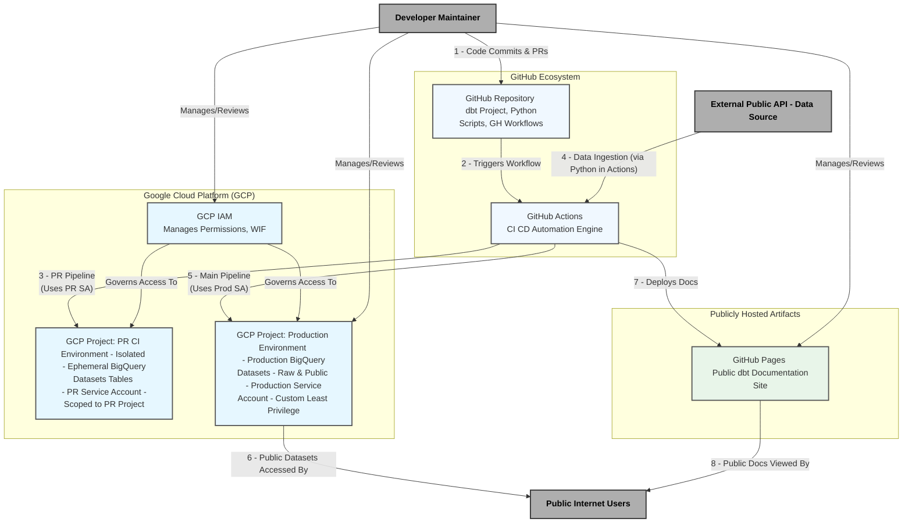

# Threat Model: pypi-vulnerabilities

- **Author/Reviewer(s):** Threat Modeling Coaching Session (User & AI Assistant)

## 1. Introduction

### 1.1 Purpose
This document outlines the threat model for a data processing application that utilizes dbt for transformations within Google BigQuery, with CI/CD orchestrated by GitHub Actions. The system produces publicly accessible BigQuery datasets (sourced from public data) and a publicly deployed dbt documentation website on GitHub Pages. The purpose of this threat model is to identify potential security and operational risks, and to document agreed-upon mitigations and controls.

### 1.2 System Overview
The application involves:
* **Data Ingestion:** A Python script fetches data from an external public API.
* **CI/CD:** GitHub Actions automates the build, test, and deployment processes for both the dbt transformations and the public documentation. Separate CI/CD pipelines and GCP environments are used for Pull Requests (PRs) and the `main` (production) branch.
* **Data Transformation:** dbt Core is used to transform raw data into structured, public-facing datasets within Google BigQuery.
* **Data Storage:** Google BigQuery houses both raw ingested data and the final transformed public datasets.
* **Documentation:** dbt docs are generated and deployed to GitHub Pages for public consumption.
* **Development Context:** Development is performed by the sole developer primarily within GitHub Codespaces. This approach is intended to limit the 'blast radius' of any potential development environment compromise and to ensure that each new change can start from a consistently defined, clean state. The system is currently maintained by a sole developer who also manages all merges to the main production branch.

### 1.3 Scope
This threat model covers the GitHub repository containing the dbt project, Python scripts, and GitHub Actions workflows; the GitHub Actions CI/CD execution environments; the Google Cloud Platform (GCP) projects used for PR/CI and Production BigQuery environments; the dbt transformation process; the Python data ingestion script; and the publicly exposed data and documentation.

### 1.4 Assumptions
The following key assumptions, based on our discussions, underpin this threat model:
* The data ingested from the external public API and subsequently published in the BigQuery datasets is *intended* to be public.
* The dbt documentation website is *intended* to be publicly accessible.
* The primary developer is currently the sole maintainer and the only individual with permissions to merge code to the `main` branch and manage production GCP resources.
* The development and CI/CD processes will adhere to the agreed-upon security controls and mitigations outlined in this document.
* Standard security practices are followed for the developer's GitHub account (e.g., strong unique password, 2FA), which is critical for securing access to development environments such as GitHub Codespaces.

## 2. System Architecture Overview

The following diagram provides a high-level overview of the system components and their interactions.

## 3. Identified Threats and Mitigations

The following table details the identified threats, their potential impact, qualitative likelihood and risk levels based on our discussions, and the agreed-upon mitigations or controls.

| Threat ID | Threat Description                                                                                                                               | Potential Impact                                                                                                | Assessed Likelihood                         | Assessed Risk | Agreed Mitigations & Controls                                                                                                                                                                                                                                                                                                                                                                                                                                                                                                                                                                                                                                                                                                                                                                                                                                                                                                                                                                                                                                                                                                                                                                                                                                                                                                                                                                                                                                | Status of Mitigation                     |
| :-------- | :----------------------------------------------------------------------------------------------------------------------------------------------- | :-------------------------------------------------------------------------------------------------------------- | :------------------------------------------ | :------------ | :-------------------------------------------------------------------------------------------------------------------------------------------------------------------------------------------------------------------------------------------------------------------------------------------------------------------------------------------------------------------------------------------------------------------------------------------------------------------------------------------------------------------------------------------------------------------------------------------------------------------------------------------------------------------------------------------------------------------------------------------------------------------------------------------------------------------------------------------------------------------------------------------------------------------------------------------------------------------------------------------------------------------------------------------------------------------------------------------------------------------------------------------------------------------------------------------------------------------------------------------------------------------------------------------------------------------------------------------------------------------------------------------------------------------------------- | :--------------------------------------- |
| T-001     | **Malicious Commit/Code Tampering:** Unauthorized or malicious changes to dbt models, Python scripts, GitHub Actions workflow files, or local actions committed to the `main` branch.   **Codespaces Context:** Development in GitHub Codespaces may reduce likelihood from local machine malware but introduces the Codespace environment itself as a context for code preparation. Impact on the application if malicious code is committed remains similar, but the broader blast radius from a compromised general-purpose local machine is reduced. | Data corruption/loss, data exfiltration, denial of service, unauthorized GCP resource usage.                  | Medium (potentially slightly reduced with Codespaces isolation) | High          | - Mandatory Pull Requests (PRs) for all changes to `main`. - Developer (sole merger) uses 2FA for GitHub account (critical for Codespaces access security). GitHub authentication is inherently managed within Codespaces. - **(Agreed to Add)** Mandatory PR status checks: SQL/dbt linting (SQLFluff), Python linting (Flake8) & SAST (Bandit), GitHub Actions workflow linting (Actionlint). - Rigorous self-review of PRs. - **(New/Enhanced for Codespaces):** Any GCP credentials used within GitHub Codespaces for development tasks must be strictly scoped with least privilege (e.g., to a dedicated development-only project and for specific development tasks like running `dbt` against dev datasets). - **(New/Enhanced for Codespaces):** Prioritize use of short-lived GCP credentials within Codespaces (e.g., developer authenticates via `gcloud auth application-default login` for ADC). Explore Workload Identity Federation for Codespaces for GCP access as a more robust long-term alternative to long-lived service account keys. | Partially In Place, Further Enhancements Agreed |
| T-002     | **Supply Chain Attacks (Dependencies & Actions):** Malicious code introduced via compromised Python dependencies, dbt packages, or third-party GitHub Actions.   **Codespaces Context:** Development in Codespaces now involves a Snyk token and a GCP development credential within the Codespace environment. Snyk scans can be run earlier in this environment, potentially reducing likelihood of vulnerable dependencies progressing. | Same as T-001. Could also lead to credential theft from CI environment. Compromise within Codespace could also lead to theft of Snyk token or GCP dev credential. | Medium                                      | High          | - **Python Dependencies:** Mandatory PR vulnerability scanning (currently `safety`, moving to Snyk). **(Enhanced):** Snyk scans are also performed by the developer within the Codespace development environment prior to commit to detect vulnerabilities earlier. - **(New/Enhanced for Codespaces):** The Snyk token used in GitHub Codespaces must be scoped with least privilege (e.g., limited to the specific repository/project being scanned). - **GitHub Actions:** Strict allowlist of `github/*` and `google/*` namespaces; version tags (e.g., `@v4`) accepted for these trusted publishers (reasoned risk acceptance for operational ease). - **dbt Packages:**   - `dbt-labs/dbt_utils`: Version range used; `package-lock.yml` not committed (reasoned risk acceptance for latest trusted patches & lower overhead). CI build's lockfile can be archived for audit.   - `brabster/dbt_materialized_udf`: Maintained by developer (first-party); pinned to specific commit SHA in `packages.yml`. - **(New/Enhanced for Codespaces):** Maintain the security of the GitHub Codespaces environment definition (`devcontainer.json`, base images, VS Code extensions) as per mitigations for T-009 and T-010. | Partially In Place, Further Enhancements Agreed |
| T-003     | **PR Pipeline Execution Against Production BigQuery Environment:** PR automated checks running with credentials that can modify production BigQuery data before merge.   **Codespaces Context:** No direct changes identified for this threat due to the introduction of Codespaces for development. | Data loss/corruption in production from unmerged PR code, bypass of merge controls.                             | High (if not mitigated)                     | Critical      | **(Agreed Mitigation):** Implement a **separate, isolated GCP project** for PR-triggered CI/CD pipeline runs. This PR environment will have its own dedicated, least-privilege Service Account, and PR workflows will target this environment, isolating them completely from production.                                                                                                                                                                                                                                                                                                                                                                                                                                                                                                                                                                                                                                                                               | Agreed to Implement        |
| T-004     | **Excessive Service Account Privileges (Production Pipeline):** The CI/CD Service Account for the `main` branch (production) pipeline having overly broad permissions (e.g., `BigQuery Admin`).   **Codespaces Context:** No direct changes identified for this threat due to the introduction of Codespaces for development. | Amplifies impact of other compromises (e.g., T-001, T-002), allowing widespread data modification/deletion or resource misuse. | Medium                                      | High          | **(Agreed Mitigation):** Create a **custom GCP IAM role** for the production CI/CD Service Account with granular, least-privilege permissions (dataset get/create/update; table get/list/create/updateData/update/delete; routine get/list/create/update/delete; jobs create). This role will *exclude* `bigquery.datasets.delete`. The `BigQuery Admin` role will be removed from this Service Account. | Agreed to Implement        |
| T-005     | **Risky Automated Cleanup Operation (Tables/Views):** Automated dbt macro deleting "orphaned" tables/views within datasets (`dry_run: False`) could cause data loss if logic is flawed or dbt graph is manipulated.   **Codespaces Context:** No direct changes identified for this threat due to the introduction of Codespaces for development. | Accidental or malicious deletion of production tables/views.                                                  | Medium                                      | High          | **(Agreed Mitigation):** Modify pipeline: Cleanup macro defaults to `dry_run: True`, outputting objects for review. A separate manual action/trigger by the developer is required for actual deletion.                                                                                                                                                                                                                                                                                                    | Agreed to Implement        |
| T-006     | **Unsafe Deletion of Redundant Datasets:** No secure process after removing `bigquery.datasets.delete` from the main CI/CD Service Account.   **Codespaces Context:** If manual dataset deletions are performed from GitHub Codespaces, the security of GCP authentication from within the Codespace is critical. The isolation of Codespaces, if secure authentication is used, may reduce the likelihood of a compromised environment leading to accidental deletion. | Accidental deletion of entire datasets by a manual process, or datasets not being cleaned up leading to clutter/cost. | Low-Medium                                  | Medium        | **(Enhanced Mitigation):** The dbt pipeline will *identify* potentially redundant datasets and report them. The developer will manually review and then perform any actual dataset deletions using their own appropriately privileged user credentials, separate from the CI/CD SA. **If performing these deletions from GitHub Codespaces, this must be done using secure GCP authentication methods, preferably short-lived user-based Application Default Credentials (ADC via `gcloud auth application-default login`).** | Agreed to Implement (Enhancement)      |
| T-007     | **External Public API Risks (Data Ingestion):** Dependency on an external public API for data ingestion.   **Codespaces Context:** No direct changes identified for this threat due to the introduction of Codespaces for development. | Data unavailability, data integrity issues (corruption, unexpected schema changes, poor quality), pipeline failures. | Medium                                      | Medium        | - Python script uses `urllib.request` (default HTTPS/SSL validation). - Transient API unavailability handled by "next scheduled run" (pipeline is idempotent, not time-critical - accepted risk/approach). - Persistent API unavailability results in script failure, triggering an email notification. - Data integrity/quality/structural changes primarily caught by downstream SQL-based tests ("write-audit-publish" pattern); failures halt updates to public data and prompt investigation. | In Place (Current Controls)  |
| T-008     | **Public Documentation Information Disclosure:** Inadvertent exposure of sensitive internal details, TODOs, or non-public model information via the publicly deployed dbt documentation website.   **Codespaces Context:** No direct changes identified for this threat due to the introduction of Codespaces for development. | Reputational damage, exposure of internal workings or unready features, attacker reconnaissance.                | Low-Medium                                  | Medium        | - Developer already writes metadata with a public audience in mind. - **(Agreed Mitigation):** The `dbt docs generate` command in the workflow will use model selection (e.g., `--select tag:public`) to ensure only intentionally public-facing models and their metadata are included in the deployed GitHub Pages site. | Partially In Place, Enhancement Agreed |
| **T-009** | **Compromised Codespace Definition or Base Image**   The `devcontainer.json` file within the repository is maliciously altered to use a compromised base image, include malicious setup scripts, or automatically install compromised tools.   *Local Dev Comparison:* Specific to version-controlled declarative environments. Vector via `devcontainer.json` is new/increased vs manual local setup. Overall risk of compromised OS/tooling might be reduced if Codespaces use trusted minimal base images. | Code tampering during development, exfiltration of secrets from Codespace, compromised developer commits, DoS of dev environment. | Medium                                      | High          | - Treat `devcontainer.json` and associated Dockerfiles/scripts as critical code, requiring rigorous PR reviews (M1a). (Status: In Place) - Strictly use base images from highly reputable/trusted sources (e.g., official Microsoft images), pinned to digests or well-maintained version tags (M1b). (Status: In Place) - Ensure setup commands in `devcontainer.json` run with least privilege (M1c). (Status: In Place) - Enforce branch protection rules for `main` for `devcontainer.json` changes (M1e - part of T-001 mitigations). (Status: In Place) - Explore tools for automated scanning of `devcontainer.json` or base images for vulnerabilities (M1d). (Status: To Be Considered)                                                                                                        | Mostly In Place, One To Be Considered    |
| **T-010** | **Exploitation of Vulnerable VS Code Extension within Codespace**   A VS Code extension (specified in `devcontainer.json` or manually installed) has a vulnerability that is exploited.   *Local Dev Comparison:* Applies to both. Impact might be reduced in Codespaces due to isolation. | Code tampering, secret exfiltration from Codespace, arbitrary command execution in Codespace, DoS of dev IDE. | Low-Medium                                  | Medium        | - Maintain a minimal, curated list of approved VS Code extensions in `devcontainer.json`; new additions via PR with risk-benefit review (M2a & user input). (Status: In Place) - Source extensions exclusively from the official VS Code Marketplace (M2b). (Status: In Place) - Periodically review `devcontainer.json` extensions for maintenance, advisories, necessity (M2c). (Status: In Place) - Developer awareness of extension risks (M2d). (Status: In Place) - Explore VS Code/Codespaces extension sandboxing features (M2e). (Status: To Be Researched)                                                                                                                                                                                                                         | Mostly In Place, One To Be Researched    |
| **T-011** | **Exfiltration of Explicitly Managed Codespace Secrets**   Secrets managed by Codespaces secrets feature (GCP dev cred, Snyk token) are exfiltrated from a running Codespace.   *Local Dev Comparison:* Risk exists in both. Potentially reduced in Codespaces if platform secret management is robust vs ad-hoc local. | Unauthorized use of Snyk token or GCP development credential.                                                 | Low-Medium                                  | Medium-High   | - **(Critical Reinforcement of T-001/T-002 mitigations):** Enforce least privilege for GCP dev credential and Snyk token used in Codespaces (M3a). (Status: Agreed to Implement) - **(Critical Reinforcement of T-001 mitigations):** Prioritize short-lived GCP credentials (user ADC via `gcloud auth`) or explore WIF for Codespaces over long-lived SA keys (M3b). (Status: Agreed to Implement/Research) - Ensure secure Codespace environment via T-009 & T-010 mitigations (M3c). (Status: In Place / Agreed to Implement) - Monitor for anomalous usage of GCP dev SA/Snyk token; review GitHub audit logs if insightful (M3d). (Status: To Be Considered) - Ensure development scripts/tools don't inadvertently log/expose secrets (M3e). (Status: Agreed to Implement) | Agreed to Implement / To Be Considered |
| **T-012** | **Denial of Service for Development (Codespaces Dependency & Operations)**   Development impeded due to Codespaces service outage, `devcontainer.json` misconfig, resource exhaustion, or **exhaustion of billing funds/spending limits for Codespaces.**   *Local Dev Comparison:* DoS risks exist in both. Codespaces add external service dependency & billing risk; reduce local hardware/OS failure risk. | Inability to code, test, or commit changes; project delays.                                                 | Low-Medium                                  | Medium        | - **M4.1 (Contingency Planning):** Define minimal local dev fallback (M4.1a); Monitor GitHub status (M4.1b). (Status: Agreed to Implement for M4.1a; In Place for M4.1b) - **M4.2 (Robust Environment Configuration & Management):** Robust `devcontainer.json` management (M4.2a); Appropriate Codespace resource configuration (M4.2b); Promote ephemeral PR Codespaces via branch deletion workflows (M4.2c); Utilize Codespaces Prebuilds (M4.2d). (Status: Agreed to Implement for M4.2a-d) - **M4.3 (Billing Assurance):** Regularly monitor Codespaces spending & ensure sufficient funding/spending limits for the GitHub account (M4.3a). (Status: Agreed to Implement)                                                                                               | Agreed to Implement / In Place         |

## 4. Other Operational Considerations & Accepted Risks

Beyond the specific threats and mitigations detailed above, several operational aspects and areas of reasoned risk acceptance were discussed:

* **Public Dataset Operational Costs/Efficiency:**
    * **Consideration:** While detailed table optimizations for the publicly exposed BigQuery datasets (such as partitioning by a relevant date column or clustering by frequently filtered columns) were deferred for now to prioritize other security mitigations, these remain important best practices.
    * **Impact if Not Optimized:** Suboptimal table structures can lead to higher storage costs for the project owner and slower, more expensive queries for public users.
    * **Recommendation/Accepted Risk:** It is recommended to periodically review the feasibility of implementing these BigQuery table optimizations as the datasets grow or usage patterns become clearer. For now, the current structure is accepted, with the understanding that optimizations can be future enhancements.

* **Monitoring & Alerting for Data Quality from External API (Relates to T-007):**
    * **Context:** Your current "write-audit-publish" pattern, with downstream SQL tests, serves as the primary gate for data quality issues originating from the external public API. Pipeline failures (which trigger email notifications) alert you to persistent API unavailability or issues caught by these downstream tests.
    * **Consideration:** While robust, this is a reactive approach to data quality issues from the API.
    * **Recommendation/Accepted Risk:** The current setup is accepted. However, if the external API's stability or data quality becomes a recurring concern, enhancing the Python ingestion script with more proactive monitoring (e.g., for significant data deviations like unexpected record counts, schema drift not caught by minimal checks, or a sudden increase in nulls for important fields) or more granular alerting directly from the ingestion step could be considered as a future improvement.

* **`dbt_utils` Versioning & `package-lock.yml` (Relates to T-002):**
    * **Context:** You use a version range (`>=1.1.1`) for the `dbt-labs/dbt_utils` package in `packages.yml` and intentionally do not commit the `package-lock.yml` file to source control.
    * **Reasoning:** This approach prioritizes automatically receiving the latest patches and minor updates from this highly trusted source (`dbt-labs`) and lowers your operational overhead for managing frequent small updates.
    * **Accepted Risk:** This is a reasoned risk acceptance. It acknowledges a trade-off against guaranteed build-to-build reproducibility of all transitive dependencies (which a committed lockfile would provide). The risk of a problematic minor/patch update from `dbt-labs/dbt_utils` causing an issue is considered low.
    * **Compensating Control:** Archiving the `package-lock.yml` generated by CI builds provides a record for auditing specific past builds if necessary.

* **GitHub Action Pinning (Relates to T-002):**
    * **Context:** Your CI/CD workflows use version tags (e.g., `@v4`) for GitHub Actions.
    * **Control:** Usage is strictly limited to your allowlist of highly trusted publishers (`github/*`, `google/*`).
    * **Reasoning & Accepted Risk:** This is a reasoned risk acceptance. It balances security (by trusting only reputable, official sources) with operational ease, avoiding the maintenance overhead of SHA pinning and managing Dependabot updates for these specific, highly reliable actions. The risk of a tag being maliciously retargeted by these specific providers is deemed very low.

* **Developer Availability (Implicit Operational Risk):**
    * **Context:** As the sole developer and maintainer, your availability is critical for responding to incidents, reviewing PRs, managing manual approval steps (like for deletions), and implementing further security enhancements.
    * **Consideration:** This is an inherent operational aspect of a solo-managed project.
    * **Recommendation:** Ensure all credentials, access methods, and documentation (like this threat model) are securely managed and potentially shareable/transferable should the need arise in the future.

* **(New) Dependency on GitHub Codespaces Service (Relates to T-012):**
    * **Context:** The primary development workflow is now dependent on the availability, performance, and correct functioning of the GitHub Codespaces service.
    * **Consideration:** While mitigations such as a potential local fallback strategy (M4.1a) and service status monitoring (M4.1b) are planned or in place, any significant or prolonged outage of the Codespaces service could impede development.
    * **Accepted Risk:** A residual risk of development interruption due to reliance on this external cloud service is accepted.

* **(New) Codespaces Configuration Management (Relates to T-009, T-012):**
    * **Context:** The `devcontainer.json` file, along with any referenced base images, extensions, and setup scripts, defines the development environment.
    * **Operational Consideration:** Secure and effective management of this configuration is an ongoing operational responsibility. This includes version control, rigorous PR reviews for changes (M1a), using trusted sources for base images (M1b), applying least privilege for setup commands (M1c), and ensuring the configuration is robust to prevent self-inflicted denial of service (M4.2a).

* **(New) VS Code Extension Governance in Codespaces (Relates to T-010):**
    * **Context:** VS Code extensions are integral to the Codespaces development experience.
    * **Operational Consideration:** The process of selecting, approving, reviewing (including risk-benefit analysis), and periodically re-evaluating VS Code extensions used in Codespaces (Mitigations M2a, M2c) is an ongoing operational task to maintain a secure and effective development environment.

* **(New) Codespaces Billing and Cost Management (Relates to T-012):**
    * **Context:** GitHub Codespaces usage incurs costs that are billed to the associated GitHub account.
    * **Operational Consideration:** Regularly monitoring Codespaces usage and associated costs, and ensuring adequate funding or appropriate spending limits for the GitHub account (Mitigation M4.3a), is a new operational responsibility to prevent denial of service due to billing issues.

* **(New) Future Security Enhancement Research & Considerations:**
    * **Context:** Several areas for potential future security enhancements related to Codespaces were identified during this review.
    * **Recommendation/Consideration:**
        * Periodically investigate and consider implementing tools for automated scanning of `devcontainer.json` configurations and specified base images for vulnerabilities (related to T-009 mitigation M1d).
        * Keep abreast of and explore potential VS Code extension sandboxing or permission-limiting features if they become available or more mature (related to T-010 mitigation M2e).
        * As a long-term goal, actively pursue and prioritize the use of Workload Identity Federation for Codespaces to access GCP resources once it's a well-established and feasible pattern, to replace any long-lived service account keys used for development (related to T-001/T-011 mitigation).
        * Evaluate the need for custom tooling/scripts for advanced Codespace management if current GitHub features (like prebuilds and branch deletion policies for ephemeral PR environments) prove insufficient for specific automation needs (related to T-012 discussion).

## 5. Conclusion

This threat modeling continuation session has specifically reviewed the implications of adopting GitHub Codespaces as the primary development environment, building upon the existing threat model for the data processing application. The introduction of Codespaces aims to enhance development environment security by promoting isolation and consistency. Our review focused on how this change impacts existing threats and introduces new considerations for the development lifecycle.

Through our collaborative discussion, several existing threats were re-evaluated in the context of Codespaces, leading to enhanced mitigations, particularly concerning the secure management of credentials (GCP development credential, Snyk token) used within the Codespace environment, emphasizing least privilege and the preference for short-lived tokens.

Furthermore, new threats specific to the use of Codespaces were identified (T-009 to T-012). These cover risks associated with the Codespace definition (`devcontainer.json`), base images, VS Code extensions, the secure handling of secrets within the Codespace, and operational dependencies such as service availability and billing. Corresponding mitigations and operational best practices have been agreed upon, including:
* Secure configuration and diligent management of the `devcontainer.json` file and its components (base images, extensions).
* Strategies for ensuring ephemeral and fresh Codespace environments, particularly for PRs.
* Contingency planning and operational awareness for Codespaces-related service dependencies and billing.

The implementation of previously agreed measures—such as isolated PR/CI environments and least-privilege production service accounts—remains crucial. This session's outcomes add further layers of security by addressing the development environment directly.

The decisions made continue to reflect a balance between robust security principles and the practical operational context of a solo developer managing a public data resource. The shift to Codespaces is seen as a positive step in hardening the development phase of the project lifecycle.

This document, now updated, serves as a snapshot of the current understanding of threats and the planned security enhancements. It is recommended that this threat model continue to be treated as a living document:

* **Implement Agreed Mitigations:** Prioritize the rollout of the newly agreed and enhanced controls discussed, particularly those relating to Codespaces security and credential management.
* **Regular Review:** Revisit and update this threat model periodically (e.g., annually, or when significant architectural changes, new tools, development practices, or new data sources are introduced) to ensure its continued relevance and effectiveness.
* **Stay Informed:** Keep abreast of emerging security best practices and potential vulnerabilities related to dbt, BigQuery, GCP, GitHub Actions, GitHub Codespaces, and any third-party dependencies.

By maintaining this proactive approach, you can ensure the continued security, integrity, and reliability of your valuable public data resource and its development lifecycle.
