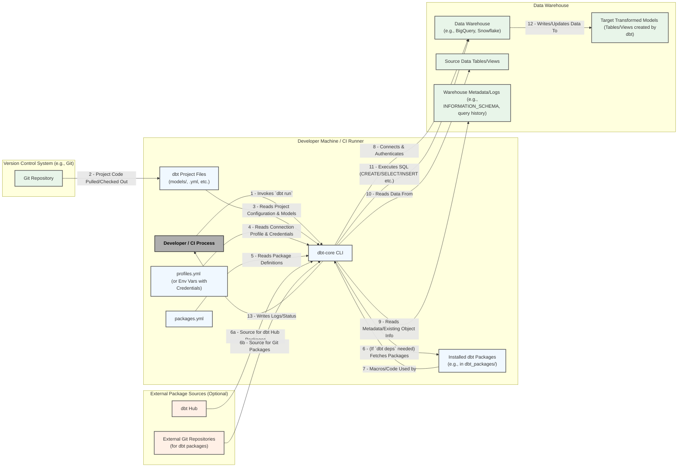

# Generic Threat Model Template: dbt-core Usage

**Template Purpose:** To provide a structured starting point for organizations to conduct threat modeling on their usage of `dbt-core`.

## 1. Introduction

### 1.1 Purpose of this Template
This document provides a generic framework and common considerations for threat modeling `dbt-core` implementations. It is intended to be adapted and customized by organizations to reflect their specific dbt project structure, data warehouse, CI/CD setup, security policies, and risk appetite. The goal is to help engineering teams and infosec professionals proactively identify and mitigate security risks associated with their use of `dbt-core`.

### 1.2 Scope
This template focuses on the security aspects of using `dbt-core` as a data transformation tool, covering its typical lifecycle:
* Local development practices.
* Configuration management (`profiles.yml`, `dbt_project.yml`).
* Interaction with data warehouses.
* Dependency management (dbt packages).
* Execution via the Command Line Interface (CLI).
* Integration into CI/CD pipelines for automated builds, tests, and deployments.

This template does *not* aim to threat model vulnerabilities within the `dbt-core` source code itself (which is the responsibility of the `dbt-core` maintainers), but rather how the tool is used and configured.

### 1.3 Target Audience for this Template
* Data engineering teams using `dbt-core`.
* Analytics engineers.
* Information security professionals reviewing or advising on dbt usage.
* DevOps/Platform engineers responsible for CI/CD pipelines running dbt.

### 1.4 General Assumptions
This template assumes a typical `dbt-core` setup where:
* `dbt-core` is used in conjunction with a supported data warehouse (e.g., BigQuery, Snowflake, Redshift, Postgres).
* The dbt project code (models, tests, configurations) is stored in a version control system (e.g., Git).
* Credentials for accessing the data warehouse are managed by `dbt-core` via `profiles.yml` or environment variables.
* CI/CD pipelines are used for automating dbt runs and deployments.

## 2. Typical dbt-core Data Flow Diagram (DFD) for a `dbt run`

The following Mermaid diagram illustrates a common data flow and interaction pattern when `dbt-core` executes a `dbt run` command, typically within a local development or CI/CD environment.

**DFD Element Descriptions:**
- **Developer / CI Process:** The entity (human or automated process) initiating dbt commands.
- **dbt-core CLI:** The `dbt-core` executable.
- **dbt Project Files:** Your SQL models, YAML configuration files, macros, tests, etc.
- **profiles.yml:** Contains connection details and credentials for the data warehouse. Often managed securely via environment variables in CI/CD.
- **packages.yml:** Defines external dbt packages to be installed.
- **Installed dbt Packages:** The actual code of third-party packages (macros, models) pulled into the project.
- **Git Repository:** Where the dbt project code is versioned.
- **Data Warehouse:** The target analytics database (e.g., BigQuery, Snowflake).
- **Source Data:** Existing tables/views in the warehouse that dbt models read from.
- **Target Transformed Models:** New or updated tables/views created/managed by dbt.
- **Warehouse Metadata/Logs:** System tables/views providing information about database objects, query history, etc.
- **dbt Hub / External Git Repositories:** Sources for third-party dbt packages.

## 3. Potential Threat Areas and Considerations

This section outlines common threat areas relevant to `dbt-core` usage. Organizations should use this as a starting point and expand based on their specific context. For each area, consider the potential threats, impacts, likelihood, and appropriate mitigations.

*(The following subsections are placeholders for the user of this template to fill in. Example prompts are provided within each to guide their thinking.)*

### 3.1 Configuration and Credential Management (e.g., `profiles.yml`)
* **Considerations:**
    * How are database credentials stored, managed, and accessed by developers locally?
    * How are credentials provided to `dbt-core` in CI/CD pipelines?
    * What is the risk of credential leakage from `profiles.yml` if committed to version control?
    * What permissions are granted to the dbt user/role in the data warehouse?
* **Example Threats:** Hardcoded credentials in Git, overly permissive database roles, insecure storage of connection profiles.
* **Example Mitigations:** Use environment variables for credentials in CI/CD, secrets management tools, principle of least privilege for database users, Git pre-commit hooks to scan for secrets.

### 3.2 dbt Project Code Integrity (Models, Macros, Tests)
* **Considerations:**
    * What is the review process for changes to dbt models and macros?
    * How is the `main` (or production) branch of the dbt project protected?
    * What is the risk of malicious SQL being introduced into dbt models or macros?
    * How are dbt tests used to ensure data integrity and validate transformations?
* **Example Threats:** Malicious SQL injection into models leading to data exfiltration or corruption, unintentional data deletion through flawed model logic, bypassing data quality checks.
* **Example Mitigations:** Mandatory PR reviews, branch protection rules, SAST for SQL/Python, comprehensive dbt testing, data diffing.

### 3.3 Dependency Management (dbt Packages via `packages.yml`)
* **Considerations:**
    * What is the process for vetting and approving new third-party dbt packages?
    * Are package versions pinned in `packages.yml`?
    * Is a `package-lock.yml` file (if applicable for dbt version) committed to version control?
    * What is the risk of using a compromised or malicious dbt package?
* **Example Threats:** Using outdated packages with known vulnerabilities, malicious code in third-party packages, unexpected breaking changes from unpinned package versions.
* **Example Mitigations:** Vet package sources, pin package versions (to specific SHAs for Git packages), code review of package updates, regular vulnerability scanning of dependencies.

### 3.4 CI/CD Pipeline Security for dbt Execution
* **Considerations:**
    * How are CI/CD pipelines triggered for dbt runs?
    * What environment (e.g., separate project/dataset) is used for running dbt during PR checks versus production deployments?
    * How are secrets (like database credentials) managed and exposed to the CI/CD runner?
    * What are the permissions of the CI/CD runner itself?
* **Example Threats:** PR pipelines affecting production data, leakage of credentials from CI logs or runner environment, compromised CI runner executing malicious dbt commands.
* **Example Mitigations:** Isolated CI environments for PRs, secrets management in CI/CD, secure runner configurations, restricted permissions for CI/CD service accounts.

### 3.5 Data Warehouse Interaction
* **Considerations:**
    * What level of access does the dbt user/role have to source data?
    * What level of access does it have to create, modify, or drop target schemas, tables, views, and UDFs?
    * Is network traffic between the dbt runner and the warehouse encrypted?
    * How are expensive or long-running queries managed or prevented?
* **Example Threats:** dbt user having excessive permissions allowing unauthorized data access or modification, denial of service through resource-intensive queries, insecure data transit.
* **Example Mitigations:** Principle of least privilege for the dbt database role, network encryption, query timeouts, cost controls in the warehouse, monitoring dbt query performance.

### 3.6 Local Development Environment Security
* **Considerations:**
    * How do developers manage `profiles.yml` on their local machines?
    * Do local dbt runs connect to production, staging, or dedicated development environments?
    * What is the risk of malware on a developer's machine compromising dbt configurations or project code?
* **Example Threats:** Accidental local runs against production, credential theft from local `profiles.yml`, compromised local dbt project files.
* **Example Mitigations:** Company policies on local credential management, use of dedicated development databases, endpoint security on developer machines, Git hygiene.

### 3.7 Operational Risks (Logging, Monitoring, Availability)
* **Considerations:**
    * How are dbt run logs captured, stored, and monitored?
    * What alerting is in place for dbt run failures or data quality test failures?
    * How is the availability of the dbt execution environment (e.g., CI runner, orchestrator worker) ensured?
* **Example Threats:** Insufficient logging hindering incident response, missed alerts for critical failures, unavailability of the dbt execution platform.
* **Example Mitigations:** Centralized logging for dbt runs, comprehensive alerting on failures and test outcomes, robust infrastructure for dbt execution.

## 4. Threat Prioritization and Mitigation Planning

*(This section is for the organization using the template to fill in. For each threat identified and deemed relevant from Section 3 or new threats specific to their environment, they should perform the following):*

1.  **Describe the Specific Threat Scenario:** Detail the threat in the context of your specific environment.
2.  **Assess Likelihood:** Estimate the likelihood of the threat occurring (e.g., High, Medium, Low).
3.  **Assess Impact:** Estimate the potential business or technical impact if the threat is realized (e.g., High, Medium, Low).
4.  **Determine Risk Level:** Combine likelihood and impact to assign an overall risk level (e.g., Critical, High, Medium, Low).
5.  **Identify Existing Controls:** Document any current mitigations or controls already in place.
6.  **Propose New/Enhanced Mitigations:** Brainstorm and document new or improved mitigations.
7.  **Assign Ownership and Target Date:** Assign responsibility and a timeline for implementing new mitigations.
8.  **Status:** Track the status of the mitigation (e.g., Not Started, In Progress, Implemented, Accepted Risk).

**Example Threat Table Structure (to be populated by the user):**

| Threat ID | Description | Likelihood | Impact | Risk Level | Existing Controls | Proposed Mitigations | Owner | Target Date | Status |
| :-------- | :---------- | :--------- | :----- | :--------- | :---------------- | :------------------- | :---- | :---------- | :----- |
|           |             |            |        |            |                   |                      |       |             |        |
|           |             |            |        |            |                   |                      |       |             |        |

## 5. Review and Maintenance

This threat model is a living document. It should be:
* Reviewed and updated periodically (e.g., annually, or semi-annually).
* Revisited whenever significant changes are made to the dbt project, data warehouse configuration, CI/CD pipeline, or underlying infrastructure.
* Updated when new vulnerabilities related to `dbt-core` or its dependencies are disclosed.
* Stored in a shared, accessible location (e.g., the dbt project's version control repository).
